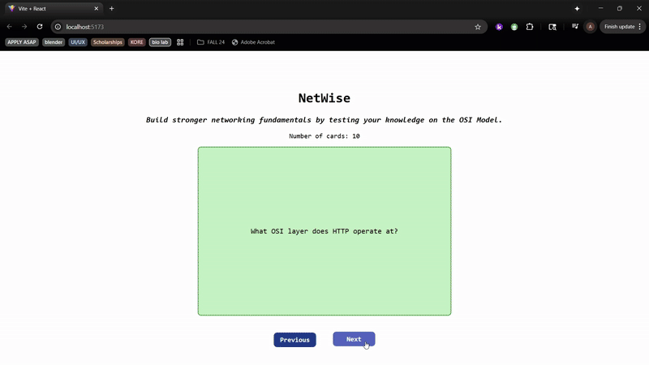

# Web Development Project 2 - *NetWise*

Submitted by: **Atuh Fon**

Description: **NetWise is a beginner-friendly flashcard web app designed to help students master the OSI (Open Systems Interconnection) model-one of the most important frameworks in computer networking. Users can study and test their understanding of the seven OSI layers, common protocols, and real-world examples. Cards are randomized to improve recall, and future updates will allow users to type in answers and navigate cards interactively.**

Time spent: **4.5** hours spent in total

## Required Features

The following **required** functionality is completed:

- [x] **The app displays the title of the card set, a short description, and the total number of cards**
  - [x] Title of card set is displayed 
  - [x] A short description of the card set is displayed 
  - [x] A list of card pairs is created
  - [x] The total number of cards in the set is displayed 
  - [x] Card set is represented as a list of card pairs (an array of dictionaries where each dictionary contains the question and answer is perfectly fine)
- [x] **A single card at a time is displayed**
  - [x] Only one half of the information pair is displayed at a time
- [x] **Clicking on the card flips the card over, showing the corresponding component of the information pair**
  - [x] Clicking on a card flips it over, showing the back with corresponding information 
  - [x] Clicking on a flipped card again flips it back, showing the front
- [x] **Clicking on the next button displays a random new card**

The following **optional** features are implemented:

- [x] Cards contain images in addition to or in place of text
  - [x] Some or all cards have images in place of or in addition to text
- [x] Cards have different visual styles such as color based on their category
  - Example categories you can use:
    - Difficulty: Easy/medium/hard
    - Subject: Biology/Chemistry/Physics/Earth science

The following **additional** features are implemented:

- [x] Flashcard flip animation using CSS 3D transforms
- [x] “Previous” button to return to earlier cards (history tracking)
- [x] Styling polish: button hover effects, rounded corners, and clear layout separation
- [x] Dynamic card counter using flashcards.length

## Video Walkthrough

Here's a walkthrough of implemented required features:

GIF created with:
- [EzGIF](https://ezgif.com/) for Windows

## Challenges
- Debugging the CSS flip animation, especially getting the .card-content and .flipped logic to work properly with absolute positioning and backface visibility
- Getting the random card logic to avoid immediate repetition
- Making sure the cards resized well and stayed centered with both text and image content
- Managing both a forward/back history system without breaking the current index

## License

    Copyright [2025] [Atuh Fon]

    Licensed under the Apache License, Version 2.0 (the "License");
    you may not use this file except in compliance with the License.
    You may obtain a copy of the License at

        http://www.apache.org/licenses/LICENSE-2.0

    Unless required by applicable law or agreed to in writing, software
    distributed under the License is distributed on an "AS IS" BASIS,
    WITHOUT WARRANTIES OR CONDITIONS OF ANY KIND, either express or implied.
    See the License for the specific language governing permissions and
    limitations under the License.
